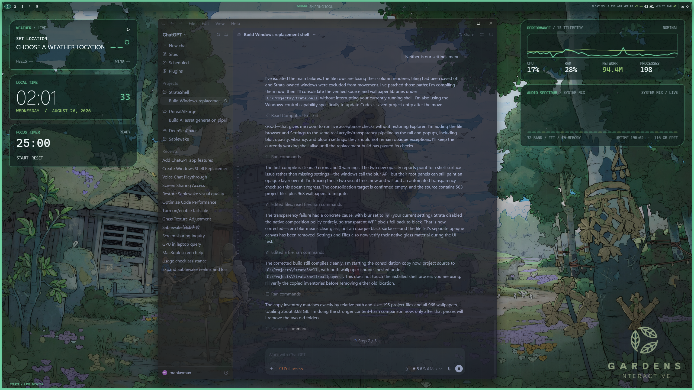
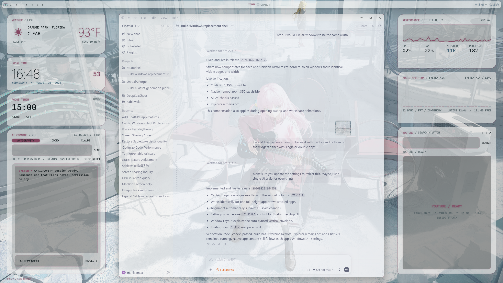

<p align="center">
  
</p>

# STRATA Shell

> A wallpaper-driven Windows shell with a Linux-compositor mindset.

STRATA Shell replaces the visible Explorer desktop experience with a keyboard-first environment built around a fixed **Center Stage**, persistent side widgets, per-monitor logical workspaces, wallpaper-derived color, translucent shell surfaces, and recoverable default-shell installation.

Windows remains underneath for application compatibility, drivers, security, and hardware APIs. It is not the visual reference.



> [!WARNING]
> STRATA Shell is experimental alpha software. Preview mode is the recommended development path. Default-shell installation is login-critical: Windows 11 Home/Pro use a reversible current-user shell policy, while supported Enterprise/Education/IoT editions use Windows Shell Launcher. Read [Installation and recovery](docs/INSTALLATION.md) before enabling it.

## What makes STRATA Shell different

- **Center Stage instead of a desktop full of windows.** Each workspace contains one full-height centered application or two applications split top/bottom. Side widgets remain anchored across workspace changes.
- **Logical workspaces with composition-synchronized motion.** Ten workspaces support directional focus, slot-preserving movement, animated switching, and full-workspace slot exchange. Tiled STRATA apps fade their live composite through geometry changes without desktop snapshots, so wallpaper pixels and scaled text cannot travel with the window, while mixed native/first-party frames stay synchronized to the destination display compositor.
- **Wallpaper as live system state.** A prepared current/±3 wallpaper neighborhood lets the image, palette, frost, graphs, widgets, bloom, console colors, and Windows light/dark preference update as one visual transaction.
- **A connected shell perimeter.** Every monitor has its own appbar-reserving top rail and independent workspace state, while a four-sided luminous surround frames the desktop. Launchers and quick panels stay on the active rail's display rather than imitating Windows flyouts.
- **STRATA-native keyboard grammar.** The Windows-logo key becomes `Super`, with direct launch, focus, movement, workspace, appearance, hardware, and recovery chords.
- **Explorer-independent essentials.** STRATA Shell includes application discovery, a launcher, Files, settings, audio, network, Bluetooth, display, session controls, wallpaper management, and direct packaged-app activation.
- **Recovery is part of the architecture.** An installed bootstrap watchdog, an Explorer fallback, an emergency non-`Super` chord, external recovery scripts, and reversible appearance changes are all first-class.

## Screenshots

| Dark composition | Light composition |
|---|---|
|  |  |

The project uses two approved wallpaper variants: `STRATA_LOGO_LIGHT.jpg` and `STRATA_LOGO_DARK.jpg`, plus the original fallback image under `assets/wallpapers`.

## Current feature set

| Area | Implemented behavior |
|---|---|
| Window management | Per-monitor Center Stage plus wide side-by-side and wide top/bottom views, display-adaptive 720p through 4K composition, one/two-app capacity, slot-preserving insertion/exchange, populated-frame STRATA transitions, visible-frame clearance, active theme border, animated repeatable focus/move/view transitions, split glass/true fullscreen, whole-window opacity toggle |
| Workspaces | 1–10 dedicated workspaces per monitor, independent current/previous state, directional slide transitions, same-layer navigation, move-and-follow, overflow to the next available workspace |
| Shell surfaces | Wallpaper desktop, dedicated top rail per monitor, edge surround, launcher, quick panels, app-tray overflow, OSD, separate keybind viewer/editor modes, icon-guided Settings, STRATA Files, STRATA Terminal, STRATA Text, STRATA Snip |
| Theme | Automatic/dark/light modes, wallpaper palette extraction, default-on Windows lock/sign-in wallpaper sync, Windows theme sync, CMD/PowerShell palette sync, vibrancy, glass transparency, independently targetable STRATA/widget Frosted Glass Blur, palette-wide bloom, high contrast, reduced motion |
| Widgets | Weather with themed/normal icons, long-form date, enhanced focus timer, color-keyed performance monitor, WASAPI system-audio spectrum, multi-provider AI CLI, streamlined embedded YouTube search/player, and a global title toggle |
| Hardware/session | Master volume, mute, in-shell output selection, microphone mute, media controls, brightness where exposed, live Wi-Fi discovery/connect/disconnect, Bluetooth discovery/pair/connect/disconnect/unpair, lock/sleep/hibernate/sign out/restart/shutdown |
| Applications | Win32 shortcuts and registered executables, packaged apps, optional native/default icons, STRATA Terminal, STRATA Text, STRATA Snip, external PowerShell, browser forced to a separate window, and searchable command/app selection for custom keybindings |
| Background apps | One first-position down-chevron opens deduplicated app-published tray icons with each app's native Open/Menu actions; tray-minimized windows leave the tiler, while non-tray background apps expose confirmed Show/Exit actions |
| Files | Editable path, debounced search, sortable Details headers, Explorer-style type-to-select, virtualized Details/Icon views, visible-first cached media thumbnails, themed STRATA file picking, compact-height ScreenPad layout, Known Folder and redirected/network locations, navigation history, hidden-file toggle beside thumbnails, properties, clipboard operations, drag/drop, rename/new folder, Recycle Bin |
| Screensaver | Full-screen per-monitor vector STRATA signal renderer after five idle minutes, 30 fast theme-colored modes, adaptive 4K particle density, restrained light field, presentation deferral, reduced-motion/high-contrast paths, any-input dismissal, manual preview |
| Updates | Stable and Preview channels from the public binary-only release feed, verified bounded downloads, immutable self-tested installation, and Explorer-gated Windows Update routes with shell warnings |
| Safety | Comprehensive self-test suite, versioned local installs, 15-minute Windows idle floor, edition-aware Home/Pro or Shell Launcher activation, external Explorer recovery tools, three-failure watchdog |

See [Implemented features and limitations](docs/FEATURES.md) for the precise current boundary.

## Center Stage model

STRATA Shell deliberately does not reproduce a conventional free-floating Windows desktop.

| Workspace contents | Layout |
|---|---|
| 1 app | The app fills the complete centered lane, aligned to the visible top and bottom widget-card edges. |
| 2 apps | The first app occupies the top slot and the second occupies the bottom slot at equal width. |
| Open a third app | The new app is assigned to the next workspace with capacity, and STRATA Shell follows it. |
| Move into a full workspace | The incoming app takes the matching slot; the displaced app returns to the source workspace. |
| Move into a half-filled workspace | The incoming app keeps its TOP/BOTTOM preference and shifts the existing app into the remaining slot. |
| Floating | Hold `Super + Ctrl` and left-click/drag anywhere inside a window to float and move it; drag its borders/corners to resize. Right-click with the same modifiers to return it to Center Stage. The active float has visual precedence only where it overlaps app windows or widget cards. |
| Glass-expanded | The active app retains transparency/effects, fills the work area with a reveal gap, and temporarily fades widgets. |
| True fullscreen | The active app becomes opaque, takes the monitor, and hides the rail until the pointer touches the top edge. |

The rendered widget envelope is measured at runtime. STRATA Shell detects 720p, 1080p, 1440p, 3K, and 4K workspaces, selects a recommended baseline, and applies the user's scale adjustment around it. One-app and two-app layouts stay aligned to visible widget edges. Each monitor's top rail also ducks whenever a managed window crosses its screen area and returns when the overlap clears.

## Requirements

### Preview and development

- Windows 11 x64
- [.NET 9 SDK](https://dotnet.microsoft.com/download/dotnet/9.0)
- Microsoft Edge WebView2 Runtime for the embedded YouTube widget

### Optional integrations

- ChatGPT desktop app for discovery through STRATA Command or assignment through the custom keybinding editor
- `agy`, `codex`, and/or `claude` executables for the AI CLI widget
- A brightness interface exposed through WMI for software brightness control

### Default-shell mode

- Windows 11 Home, Pro, Enterprise, Education, or IoT Enterprise
- Administrator approval only when the selected edition uses Windows Shell Launcher
- A local self-contained STRATA Shell release; UNC/network executables are rejected

## Run a safe preview

```powershell
git clone https://github.com/ManiaxMax/StrataShell.git
cd StrataShell
dotnet restore .\src\StrataShell\StrataShell.csproj
dotnet run --project .\src\StrataShell\StrataShell.csproj -- --preview
```

Preview mode shows the shell without changing the configured Windows shell. Use `Ctrl + Alt + Shift + Delete` to exit preview if needed.

Additional startup modes and acceptance commands are documented in [Development and testing](docs/DEVELOPMENT.md).

## Build

```powershell
dotnet build .\src\StrataShell\StrataShell.csproj -c Release
```

Run the noninteractive installed-environment checks:

```powershell
.\src\StrataShell\bin\Release\net9.0-windows10.0.26100.0\win-x64\StrataShell.exe --self-test --quiet
```

The self-test writes its JSON report to `%LOCALAPPDATA%\StrataShell\Recovery\self-test.json`. Some checks are intentionally machine-dependent, including wallpaper libraries and the ChatGPT packaged-app identity.

## Wallpaper libraries
 
Stable STRATA Shell packages ship one approved Light wallpaper and one approved Dark wallpaper:
 
```text
wallpapers/
├── WallpapersDark/STRATA_LOGO_DARK.jpg
└── WallpapersLight/STRATA_LOGO_LIGHT.jpg
```
 
- `Super + Ctrl + Up` selects the Light collection and light application theme.
- `Super + Ctrl + Down` selects the Dark collection and dark application theme.
- `Super + Ctrl + Left/Right` moves backward/forward in the active collection.
 
The picker provides search, pagination, thumbnails, and a full preview. Its **Browse file** action opens STRATA Files in selection mode. The library is watched recursively: adding, deleting, or replacing a supported local image refreshes both the chooser and cycling shortcuts without restarting STRATA Shell. Official packages remain restricted to the two approved files; `assets/wallpapers/strata-signal.png` is the emergency fallback.

## Essential shortcuts

| Shortcut | Action |
|---|---|
| `Super + Space` | Command launcher |
| `Super + Enter` | STRATA Terminal |
| `Super + S` | STRATA Snip |
| `Super + B` | New browser window |
| `Super + F` | STRATA Files |
| `Super + Ctrl + S` | Settings |
| `Super + -` | Remove the highest workspace when it is empty (minimum 1) |
| `Super + +` | Add a workspace (maximum 10) |
| `Super + K` | Searchable read-only keybind list |
| `Super + Ctrl + K` | Keybinding Editor (unmodifiable permanent shortcut) |
| `Super + Shift + T` | Toggle transparency for the active third-party or STRATA window |
| `Super + Shift + D` | Cycle the active monitor through Center Stage, wide side-by-side, and wide top/bottom |
| `Super + Shift + \` | Cycle window expansion (Glass-expanded → True fullscreen → Center Stage) |
| `Super + Arrow` | Focus the next existing window in the bounded spatial path |
| `Super + Shift + Arrow` | Move/fill/swap the active app in that direction |
| `Super + 1…0` | Switch workspace 1…10 |
| `Super + Alt + 1…4` | Select monitor 1…4 and focus its current workspace |
| `Super + Alt + Shift + 1…4` | Move the active app to monitor 1…4's current workspace |
| `Ctrl + Alt + Shift + Delete` | Exit preview or restore Explorer from shell mode |

The exact 68-binding default policy plus user remapping rules are documented in [Keybindings](docs/KEYBINDS.md).

## Default-shell installation

Do not enable shell mode before testing preview, ChatGPT/terminal launch, and Explorer recovery on the target machine.

```powershell
powershell.exe -NoProfile -ExecutionPolicy Bypass -File .\scripts\Install-StrataShell.ps1 -Activate -ActivationMode Auto
```

The installer publishes a self-contained, versioned release beneath `%LOCALAPPDATA%\Programs\StrataShell`, scans and initializes portable state, runs its self-test, writes recovery tools beneath `%USERPROFILE%\Strata Recovery`, and selects the correct Home/Pro policy or Shell Launcher route automatically. `scripts\Build-InstallerBundle.ps1` creates a self-contained ZIP whose target PC does not need the .NET SDK.

Read the full [installation, update, and recovery guide](docs/INSTALLATION.md) first.

## Packaged release installation
 
Stable STRATA Shell releases provide self-contained single-file installers (`StrataShell-Setup-<version>-win-x64.exe`) and portable ZIP bundles (`StrataShell-<version>.zip`) published on [GitHub Releases](https://github.com/ManiaxMax/StrataShell-Releases). Preview updates are framework-dependent and intentionally omit the runtime, Setup executable, wallpaper library, and Stable-only extras.
 
- Includes the self-contained .NET 9 desktop runtime.
- Bundles the two approved Light/Dark wallpaper variants.
- Configures STRATA Launcher, Start Menu shortcuts, uninstaller, and external Explorer recovery tools.
- Supports edition-aware activation for Windows 11 Home, Pro, Enterprise, Education, and IoT Enterprise.
- Provides seamless, silent background updates via **Settings → Updates** with automatic bootstrap version delegation upon sign-in.
- Shipped defaults use the privacy-safe schema-29 allowlist documented in [SHIPPED_DEFAULTS.md](docs/SHIPPED_DEFAULTS.md).
 
```powershell
.\scripts\Build-StrataInstaller.ps1 -Version '<version>'
.\scripts\Test-StrataInstaller.ps1
```

## Repository map

```text
assets/                    Bundled fallback wallpaper, branding, and local YouTube host
docs/                      Product, architecture, settings, operation, and screenshots
installer/                 Privacy-scrubbed defaults for packaged installations
scripts/                   Publish, installer, validation, edition-aware shell, and recovery tools
src/StrataLauncher/        Explorer-mode maintenance and shell launcher utility
src/StrataMaintenance/     Shared install, update, repair, reset, and restore logic
src/StrataSetup/           Self-contained graphical installer and uninstaller
src/StrataShell/           WPF application and Win32/DWM integration
wallpapers/                Exactly two approved Stable wallpapers and their policy notes
```

Key documents:

- [Implemented features and limitations](docs/FEATURES.md)
- [First-party applications](docs/FIRST_PARTY_APPS.md)
- [Settings reference](docs/SETTINGS.md)
- [Keybindings](docs/KEYBINDS.md)
- [Architecture](docs/ARCHITECTURE.md)
- [Screensaver](docs/SCREENSAVER.md)
- [Installation and recovery](docs/INSTALLATION.md)
- [Development and testing](docs/DEVELOPMENT.md)
- [Product contract](docs/PRODUCT.md)
- [Reference research](docs/REFERENCE_RESEARCH.md)
- [Contributing](CONTRIBUTING.md)
- [Security policy](SECURITY.md)

## Important boundaries

- STRATA Shell does not intercept `Ctrl + Alt + Delete`, UAC secure desktop, sign-in, Windows Recovery, or other Windows-owned security surfaces.
- Application transparency is whole-window alpha. STRATA Shell cannot force arbitrary third-party toolkits to render their internal materials as acrylic.
- Blur, bloom, and spring/wobble effects are guaranteed for first-party shell surfaces. True mesh deformation of unrelated application pixels is not implemented.
- Microsoft Media Player uses a single-stage opaque compatibility path so auxiliary playback/control surfaces do not consume workspaces or lose hardware video composition. Other protected/video windows may still reject DWM style, border, chrome, or opacity changes.
- Ordinary Wi-Fi, Bluetooth, and audio workflows stay inside STRATA Shell. Hardware-required pairing consent/PIN, drivers, display topology, UAC, and notification permissions remain protected Windows surfaces.
- The YouTube widget opens account sign-in and management in the default browser; credentials are not entered into or retained by the embedded player.

## License

No open-source license has been selected yet. Public source visibility alone does not grant reuse, redistribution, or derivative-work rights beyond GitHub's Terms of Service. Add an explicit `LICENSE` before accepting outside redistribution.
