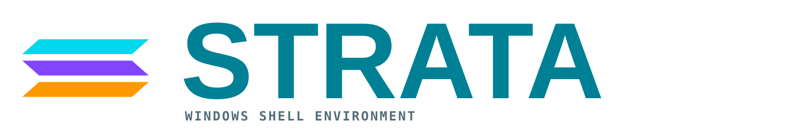
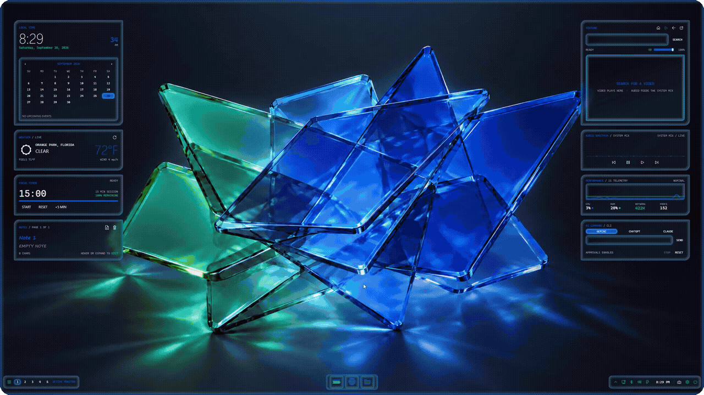

  

**A wallpaper-driven desktop shell for Windows 11.** STRATA brings workspaces, glass surfaces, widgets, first-party apps, and wallpaper-matched Light and Dark themes into one desktop environment. Windows continues to handle drivers, secure sign-in, UAC, and protected system functions.

  

*Wallpaper and theme showcase. Motion and colors depend on the selected wallpaper and settings.*

## Download and release status

- **Stable:** [1.0.23](https://github.com/ManiaxMax/StrataShell-Releases/releases/tag/v1.0.23) has a complete Windows 11 x64 Setup and portable ZIP with the .NET 10 Desktop runtime and 24 approved 4K wallpapers. [Release notes](docs/RELEASE_NOTES_1.0.23.md).
- **Preview:** [20260927-182410](https://github.com/ManiaxMax/StrataShell-Releases/releases/tag/20260927-182410) is a lightweight test update. Preview packages omit the runtime and wallpaper library and require a compatible Stable installation or registered runtime.

For a fresh installation, start with [Stable](https://github.com/ManiaxMax/StrataShell-Releases/releases/latest). In STRATA, **Settings → Updates** selects Stable or Preview and installs available updates. The external STRATA Launcher checks Stable only. Read [installation and recovery](docs/INSTALLATION.md) before using STRATA as your sign-in shell. STRATA is experimental alpha software; source and package checks do not establish physical installed-shell acceptance. [Current verification status](docs/STATUS.md).

## Explore STRATA

| Surface | What it does |
|---|---|
| **Floating** | Move, resize, overlap, minimize, and switch ordinary application windows; use the dock and workspace controls. |
| **Tiled / Center Stage** | Give one app the center lane or split it between two apps. Wide and Dynamic views offer other arrangements, with independent workspaces per monitor. |
| **Sphered** | Collect apps, web pages, and settings into a Sphere window on each monitor. Tabs can form independent two-pane groups; supported native windows keep their own input and rendering. |
| **Rail or Dock** | Switch between the connected application rail and separate glass dock while keeping the same desktop state. |

The active wallpaper drives palette, accents, glass, and compatible window chrome. Choose **Auto**, **Light**, or **Dark** appearance; tune transparency, 3D Glass, blur, bloom, quality, interface typography, and Reduced Motion in Settings. The approved Stable wallpaper library contains 12 colors in both Light and Dark. [Features and limitations](docs/FEATURES.md) · [Sphered behavior](docs/SPHERED.md).

The desktop includes Clock/Calendar, Weather, Focus Timer, Notes, Performance, Audio Spectrum, YouTube, and AI Command widgets. First-party apps include STRATA Browser, Files, Terminal, Text, Snip, Paint, Image Viewer, Media Player, Calendar, and Task Manager. Files can open Windows' native Security permissions page for physical files and folders. Browser, Files, Terminal, and other tabbed surfaces keep crowded tabs reachable with scrolling and selection reveal. Hardware and third-party app behavior still depend on Windows, drivers, and the app. [First-party app guide](docs/FIRST_PARTY_APPS.md).

**Language:** Settings offers 25 language/region choices and Follow Windows, with live changes in Settings navigation and selected shared controls. Many app-specific screens, errors, Setup, and Launcher remain in English; native-speaker review is open. [Settings guide](docs/SETTINGS.md).

## Fresh-install defaults

New installations start in **Floating** mode at **Balanced** quality, with five workspaces and Browser and Files pinned. The left widget column has Clock/Calendar, Weather, Focus Timer, and Notes; the right has YouTube, Audio Spectrum, Performance, and AI Command. Clock and YouTube begin locked expanded. Updates and repairs preserve existing preferences.

## Essential shortcuts

Super is the Windows-logo key. Shortcuts can be changed in STRATA; the live keybind viewer shows the active bindings.

| Shortcut | Action |
|---|---|
| Super + Space | STRATA Command |
| Super + Ctrl + D | Switch Floating / Tiled |
| Super + Ctrl + S | Enter or leave Sphered mode |
| Super + Ctrl + R | Switch Rail / Dock |
| Super + Ctrl + W | Change the active window view or widget state |
| Super + B / Super + F | Browser / Files |
| Super + Enter | Terminal |
| Super + 1…0 | Select workspace |
| Super + T | Active-window transparency |
| Ctrl + Alt + Shift + Delete | Emergency Explorer recovery |

[Complete keybindings](docs/KEYBINDS.md).

## Documentation and repositories

[Release status](docs/STATUS.md) · [Installation and recovery](docs/INSTALLATION.md) · [Features and limits](docs/FEATURES.md) · [Settings](docs/SETTINGS.md) · [First-party apps](docs/FIRST_PARTY_APPS.md) · [Keybindings](docs/KEYBINDS.md) · [Security reporting](SECURITY.md)

The private [StrataShell source repository](https://github.com/ManiaxMax/StrataShell) contains application code and development evidence. The public [StrataShell-Releases repository](https://github.com/ManiaxMax/StrataShell-Releases) contains documentation, branding, and compiled release downloads. Documentation changes do not create a new application package or alter an installed shell.
